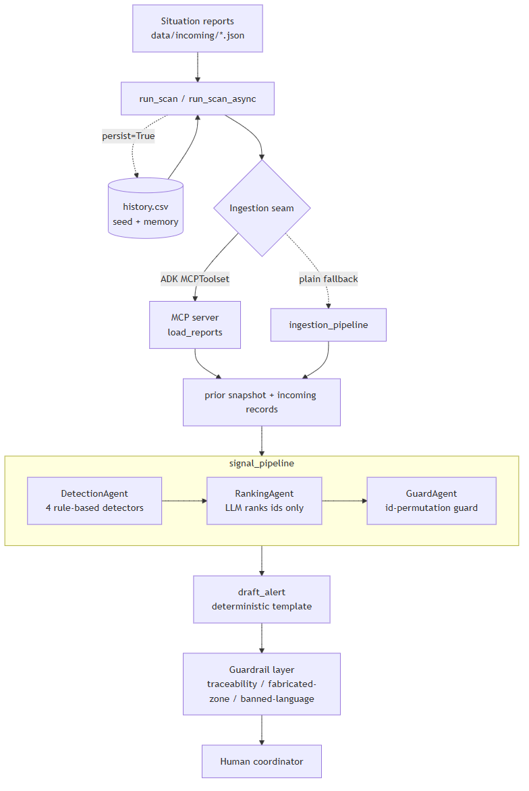
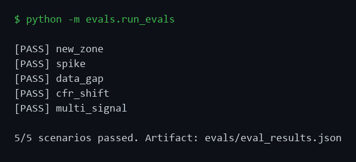
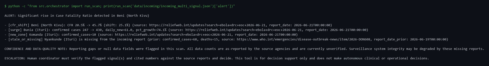

# Ebola Surveillance Signal-Detector Agent — Submission Writeup

*Kaggle "AI Agents: Intensive — Vibe Coding" capstone · Agents for Good (healthcare) track.*

## 1. Problem

During a fast-moving Ebola outbreak, outbreak-response coordinators in the Democratic Republic
of the Congo receive a flood of unstructured situation reports — WHO, CDC, ECDC, ReliefWeb,
MSF — across dozens of affected health zones. Spotting a **newly affected zone** or an
**accelerating cluster** early is what lets responders isolate cases fast, and isolation speed
is the single biggest lever on outbreak size.

Real-world grounding (as of mid-June 2026): the 17th DRC Ebola outbreak (Bundibugyo virus,
declared 15 May 2026) reached ~896 confirmed cases and 232 deaths across 31 health zones, with
Ituri as the epicentre and spread to North/South Kivu and Uganda; WHO declared a PHEIC. CDC
modelling indicates that if 70% of cases isolate within two days there is a ~94% probability of
keeping the outbreak under 10,000 cases — **detection and isolation speed is decisive**, yet
the IRC estimated only ~20% of contacts were being located. Sources:
[WHO](https://www.who.int/emergencies/situations/ebola-outbreak---drc-2026),
[CDC](https://www.cdc.gov/ebola/situation-summary/index.html),
[ECDC](https://www.ecdc.europa.eu/en/ebola-outbreak-democratic-republic-congo-and-uganda),
[ReliefWeb](https://reliefweb.int/disaster/ep-2026-000071-cod),
[MSF](https://www.doctorswithoutborders.org/latest/ebola-disease-outbreak-2026-how-msf-responding).

This agent compresses the detection step from hours of manual reading into a ranked,
source-cited brief for a human to act on.

## 2. What it does

It ingests public aggregate situation reports, tracks case/death counts per health zone over
time, and flags four kinds of signal:

- **new_zone** — a health zone appearing for the first time,
- **surge** — confirmed-case growth above a configurable rate/relative threshold,
- **cfr_shift** — a rise in case-fatality ratio past a threshold,
- **stale_or_missing** — an expected zone missing from a report, or a null required field.

It then ranks the flags by urgency and drafts a short, source-cited alert ending in a
human-escalation line. A guardrail layer validates the brief before it leaves.

## 3. Architecture



*(Diagram source: [`docs/images/architecture.mmd`](images/architecture.mmd), rendered with mermaid-cli.)*

**The core design and division of labor (preserved everywhere):** detection is **rule-based
Python** (`src/signal/detectors.py`). The **LLM never computes a flag** and never sees raw
counts — the `DetectionAgent` hands the ranking LLM only `{id, detector, health_zone}`, and the
LLM returns only an ordering of ids. A deterministic **guard** (`src/signal/ranking.py`)
verifies that ordering is a clean permutation and otherwise falls back to a fixed priority
(`cfr_shift > surge > new_zone > stale_or_missing`). If the ranking model is itself unavailable
(quota/network), the scan degrades to that same deterministic ordering rather than failing. The
alert is a deterministic template; the
LLM's free-text reasoning is logged but **never rendered** into the human-facing brief.

## 4. The four course concepts demonstrated

1. **Multi-agent system (Agent Development Kit).** `src/signal/signal_pipeline.py` composes a
   `SequentialAgent` of `DetectionAgent → RankingAgent → GuardAgent` (ADK `LlmAgent` +
   `BaseAgent`), driven by an ADK `Runner` from `src/orchestrator.py` (`google-adk==2.3.0`).
2. **Tools / MCP server.** `src/ingestion/mcp_server.py` exposes ingestion as an MCP tool
   (`load_reports`). The orchestrator consumes it through the ADK **`MCPToolset`**, with a
   plain-function fallback so an MCP problem can never block a scan. Parity between the two
   paths is verified (see `walkthrough.md`).
3. **Memory / context engineering.** `src/memory/history_store.py` appends scanned reports to
   the durable history so each scan compares against the accumulated past; persistence is
   opt-in (`run_scan(..., persist=True)`) to keep demos reproducible, skips null-count rows
   (history stays complete), and upserts on the identity key.
4. **Quality & security.** A guardrail layer (`src/guardrails/guardrails.py`) and a detection
   eval set (`evals/`) — detailed in §6–7.

## 5. Data policy and ethics (non-negotiable)

- Use only **public, aggregate** data. **Never patient-level** records.
- **Every number** the agent outputs must trace to a source record (`report_date` +
  `source_url`); unsourced numbers are blocked by the guardrail.
- The agent **supports** decisions — a human coordinator always decides and acts; every alert
  ends with an escalation line.
- Outputs carry uncertainty and data-quality caveats, never false confidence.
- **Non-goals:** no clinical diagnosis of any individual, no treatment recommendations, no
  patient-level data, no predictive epidemic modelling, no real-time deployment claims.

## 6. Safety design (the guardrail layer)

`enforce_guardrails(alert_text, ranked_flags)` runs after the alert is drafted, before it
leaves, and is **fail-closed**:

- **Number traceability** — every number in the prose must render from a sourced ranked flag
  (using the same formatting helpers the template uses, so the check cannot drift). URLs are
  redacted before scanning so digits inside a source URL never read as unsourced.
- **No fabricated zones** — every zone cited in a signal line must be a real flag zone.
- **No clinical / treatment / forecasting language** — blocked and flagged by default
  (configurable to strip), scanning prose only and whitelisting operational terms (e.g. "Ebola
  Treatment Center").
- **Escalation line** ensured (idempotent).

On an integrity failure the prose is **withheld**, but the placeholder still surfaces the
underlying sourced signals with their source URLs plus the escalation line — withholding the
brief never discards the signal.

## 7. Verification & evals

- **Detection eval set** — `evals/eval_set.json` pairs each of the five reports with its
  expected flags `(detector, health_zone, type)`. `evals/run_evals.py` scores `run_all_detectors`
  by **exact-set match**, hermetically (no live LLM, detection-stage-direct, fully
  reproducible), and writes `evals/eval_results.json`. Current result: **5/5 pass**.

  

- **Scenario baselines** — `baselines/` captures the detector set and rendered alert per
  scenario; `walkthrough.md` records the five scenarios end-to-end and the MCPToolset-vs-plain
  ingestion parity (records identical).
- **Test suite** — **39 automated tests** (detectors, id-guard, alert template + traceability,
  ADK signal pipeline ids-only projection + ranking-failure fallback, orchestrator wiring incl.
  Kaggle-safe async, guardrails, memory, evals). The suite is hermetic apart from two
  integration tests that exercise the live model when available and otherwise pass via the
  deterministic fallback (so it stays green even when the Gemini quota is exhausted).

## 8. Scenario walkthrough

| Scenario | File | Top signal | What it demonstrates |
|---|---|---|---|
| new_zone | `incoming_new_zone.json` | new_zone (Komanda) | first-appearance detection |
| spike | `incoming_spike.json` | surge (Mongbwalu) | rate/relative growth threshold |
| data_gap | `incoming_data_gap.json` | stale_or_missing | missing zone + null field |
| cfr_shift | `incoming_cfr_shift.json` | cfr_shift (Beni) | fatality-ratio rise, CFR_MIN_CONFIRMED gate |
| multi_signal | `incoming_multi_signal.json` | cfr_shift (Beni) | all four detectors + ranking |

Example output (`multi_signal`), verbatim from `run_scan`:

```
ALERT: Significant rise in Case Fatality Ratio detected in Beni (North Kivu)

- [cfr_shift] Beni (North Kivu): CFR 20.5% -> 45.7% (shift: 25.1%) (source: https://reliefweb.int/updates?search=ebola+drc+eoc+2026-06-21, report_date: 2026-06-21T00:00:00)
- [surge] Bunia (Ituri): confirmed cases 247 -> 430, daily_new=61.0, pct_growth=74.1% (source: https://reliefweb.int/updates?search=ebola+drc+eoc+2026-06-21, report_date: 2026-06-21T00:00:00)
- [new_zone] Komanda (Ituri): confirmed_cases=10 (source: https://reliefweb.int/updates?search=ebola+drc+eoc+2026-06-21, report_date: 2026-06-21T00:00:00)
- [stale_or_missing] Nyankunde (Ituri) is missing from the incoming report (prior: confirmed_cases=68, deaths=15, source: https://www.who.int/emergencies/disease-outbreak-news/item/2026-DON608, report_date_prior: 2026-06-19T00:00:00)

CONFIDENCE AND DATA-QUALITY NOTE: Reporting gaps or null data fields were flagged in this scan. All data counts are as-reported by the source agencies and are currently unverified. Surveillance system integrity may be degraded by these missing reports.

ESCALATION: Human coordinator must verify the flagged signal(s) and cited numbers against the source reports and decide. This tool is for decision support only and does not make autonomous clinical or operational decisions.
```



(The ranked order is the live model's choice, validated by the guard — or the deterministic
fallback ordering shown here when the model is unavailable; either way the detector *set* and
every number are deterministic. The eval runner scores that set, not the order.)

## 9. Limitations

- **Prototype on curated data**, not a real-time system; reports are curated JSON, not a live
  feed.
- **Rule-based, explainable detection** — deliberately not predictive/forecasting modelling.
- The **LLM is confined to ranking and phrasing**; it never computes a flag, sees a raw count,
  or writes a number into the brief.
- Thresholds are tuned for the demo and configurable in `src/config.py`; they would need
  epidemiological calibration for real use.
- Ranking quality depends on the model and is non-deterministic; the system is designed so this
  **cannot** affect detection correctness or numeric integrity — the guard and guardrail bound
  the LLM's influence.

## 10. Reproducing

See [README.md](../README.md) for setup and commands: `python -m evals.run_evals` (5/5),
`python -m scripts.verify_scenarios` (five alerts end to end), and
`python -m unittest discover -s tests` (38 tests). Durable rules: [context.md](context.md);
build plan and acceptance criteria: [implementation.md](implementation.md).
```
