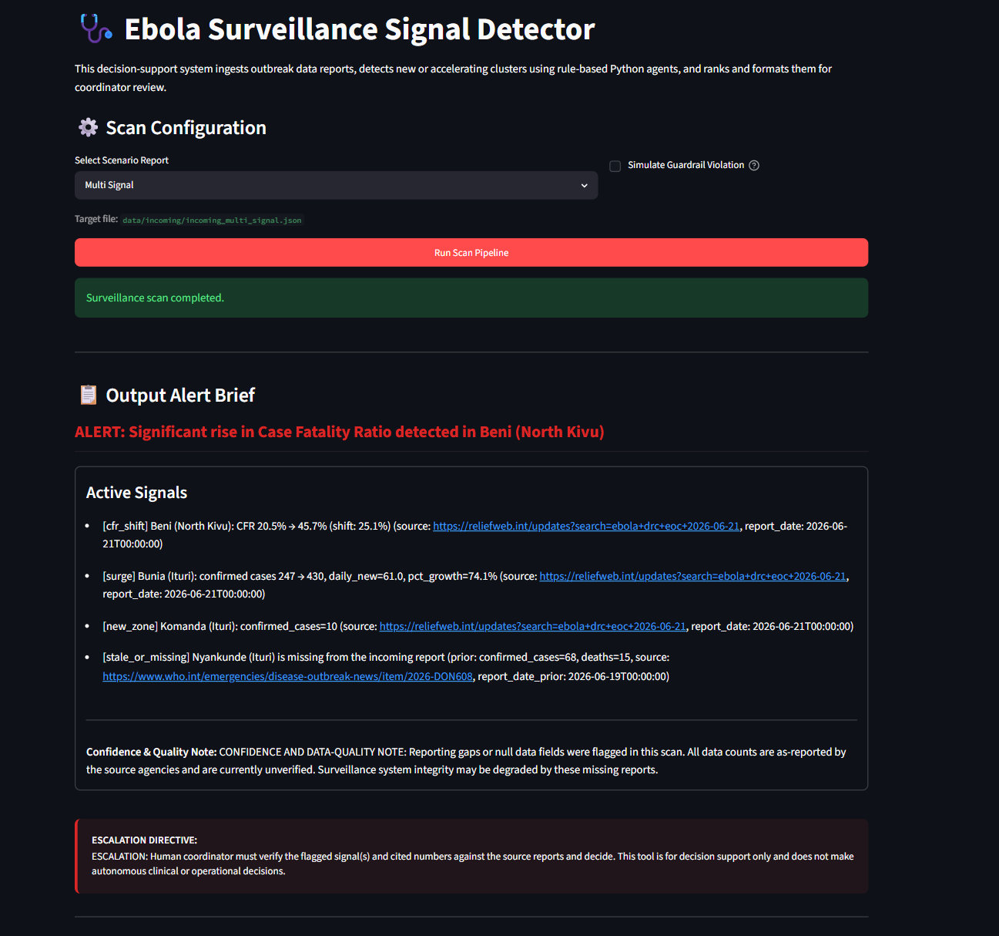
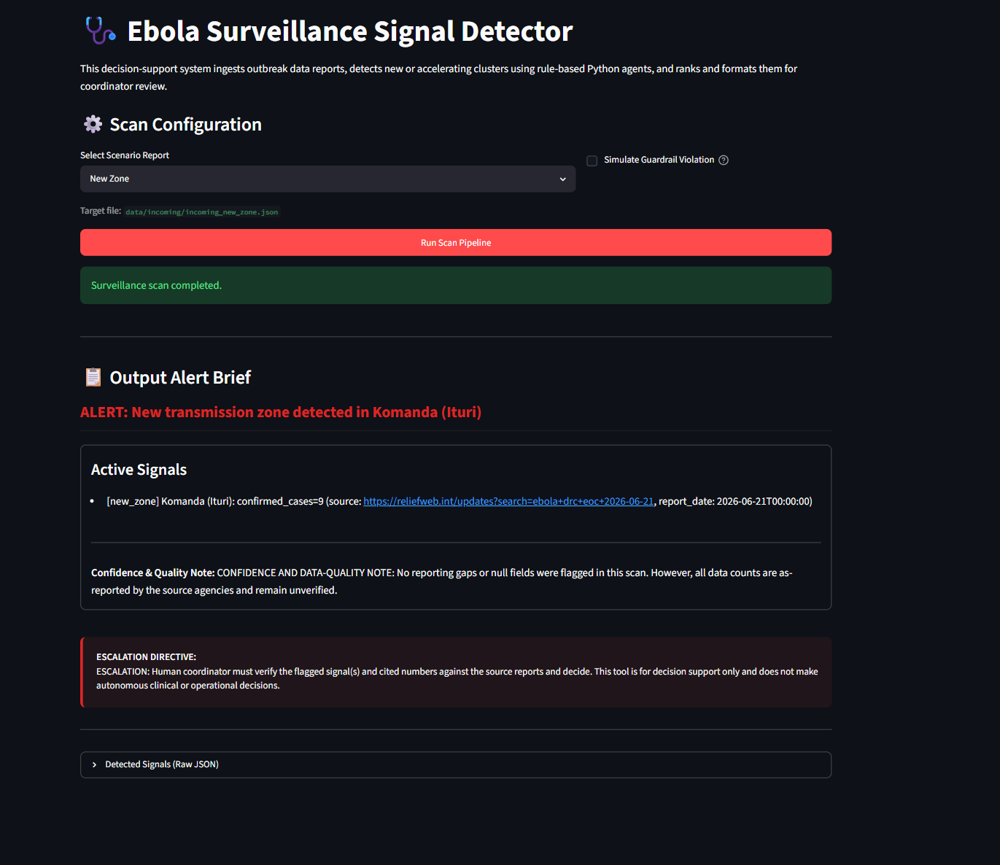
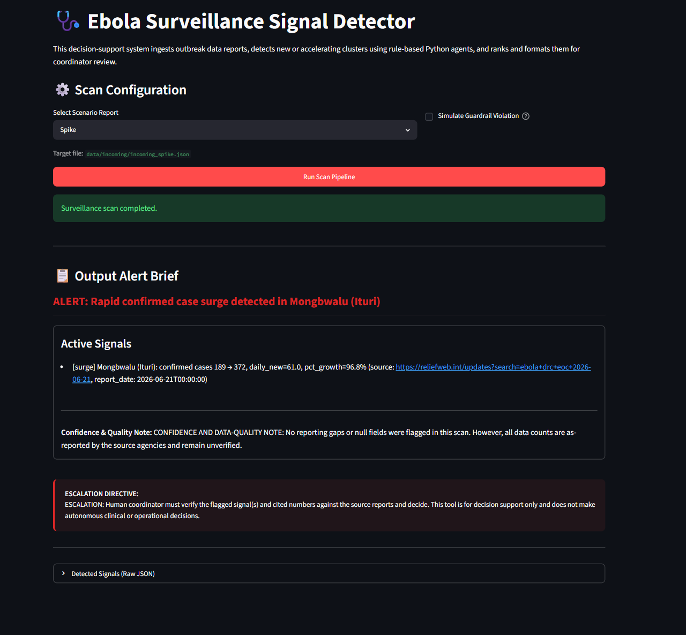
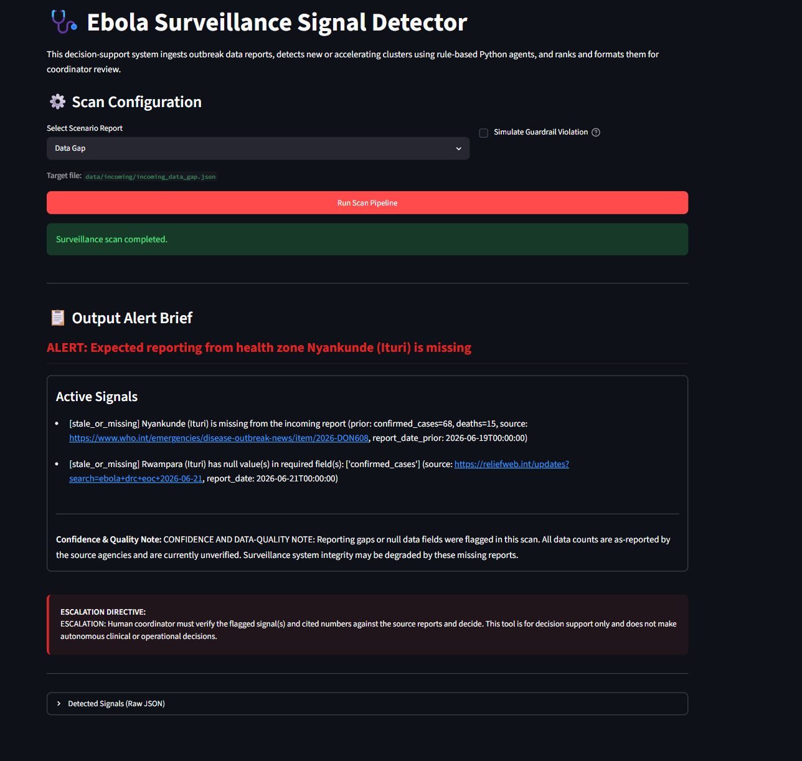
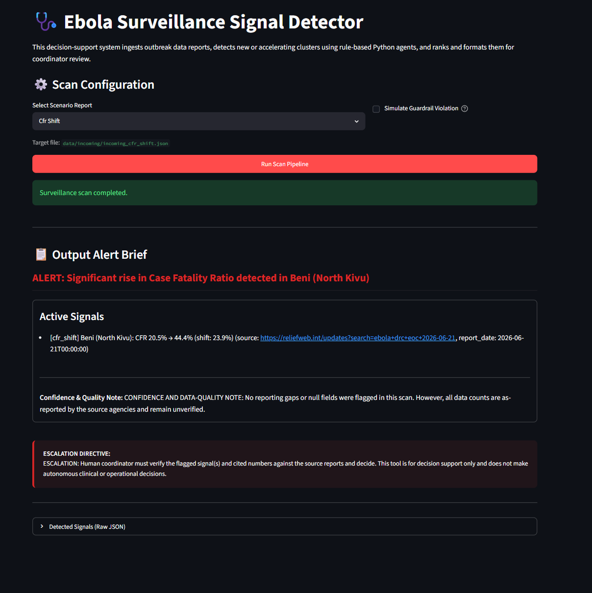
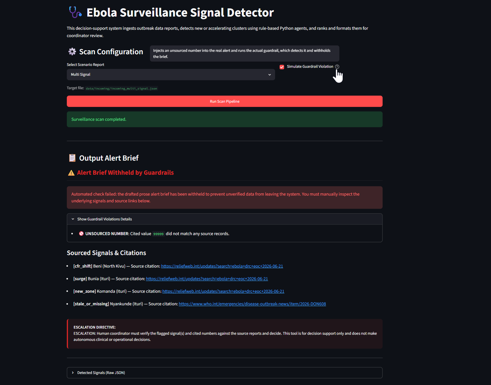

# Walkthrough — Streamlit UI Wrapper Implementation

We have built a minimal interactive browser UI using Streamlit as a thin presentation layer around the existing Ebola surveillance agent pipeline. This UI lets users easily select scenarios, execute scans, review the structured alert briefs (or withheld notices), and inspect the raw signal payloads.

The existing pipeline logic (`src/`), detectors, alert agents, and guardrails remain entirely untouched, and all 39 unittest cases pass successfully without modification. All work has been done on the `feature/streamlit-ui` branch.

## Changes Made

1. **Dependency Addition**: Added `streamlit` to [requirements.txt](requirements.txt).
2. **Streamlit UI Application**: Created [app_streamlit.py](app_streamlit.py):
   - Set zinc-inspired theme configurations and standard responsive container styles.
   - Built a scenario selector dropdown mapping names (`multi_signal`, `new_zone`, `spike`, `data_gap`, `cfr_shift`) to files in `data/incoming/`.
   - Integrated a primary action button running `run_scan_async` inside a loading spinner.
   - Rendered results: Alert brief headline, active signals with clickable source URLs, confidence notes, and the critical **Escalation Directive** in a highly visible red callout box.
   - Handled the guardrail withheld state using a fallback layout that displays a safety warning along with the underlying signals and details of the guardrail violations.
   - Added a "Simulate Guardrail Violation" toggle to allow coordinators to test the withheld display logic.
   - Included a raw signals JSON viewer.
3. **Documentation**: Appended startup and usage instructions to [README.md](README.md).

---

## Verification Results

### 1. Automated Test Suite (39/39 Passed)
The full unittest suite was run to confirm zero regressions:
```
Ran 39 tests in 8.936s

OK
```

### 2. Five-Scenario UI Walkthrough

All scenarios have been manually exercised and verified through the browser:
- **Scenario 1: Multi Signal (Default)**: Correctly loaded, showing a Case Fatality Ratio alert for Beni, multiple active signals, and the standard confidence and escalation notes.
- **Scenario 2: New Zone**: Correctly loaded, showing an alert for a new transmission zone detected in Komanda (Ituri).
- **Scenario 3: Spike**: Correctly loaded, showing a rapid confirmed case surge in Mongbwalu (Ituri).
- **Scenario 4: Data Gap**: Correctly loaded, showing a missing report alert for Nyankunde (Ituri).
- **Scenario 5: CFR Shift**: Correctly loaded, showing a significant rise in CFR in Beni (North Kivu).
- **Simulated Guardrail Block**: With "Simulate Guardrail Violation" enabled, the alert prose is safely withheld. The UI displays the safety notice, the list of violations (e.g. `UNSOURCED NUMBER`), the underlying signals, and the escalation directive.

---

## Visual Demonstrations

Here is a carousel of screenshots captured during browser verification of the scenarios and the simulated guardrail block:

````carousel

<!-- slide -->

<!-- slide -->

<!-- slide -->

<!-- slide -->

<!-- slide -->

````

### Browser Interactive Session Video
For a full review of the interactive testing session, view the recorded session:

